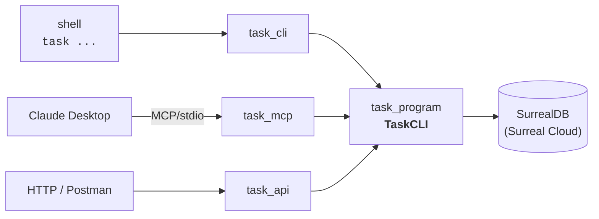
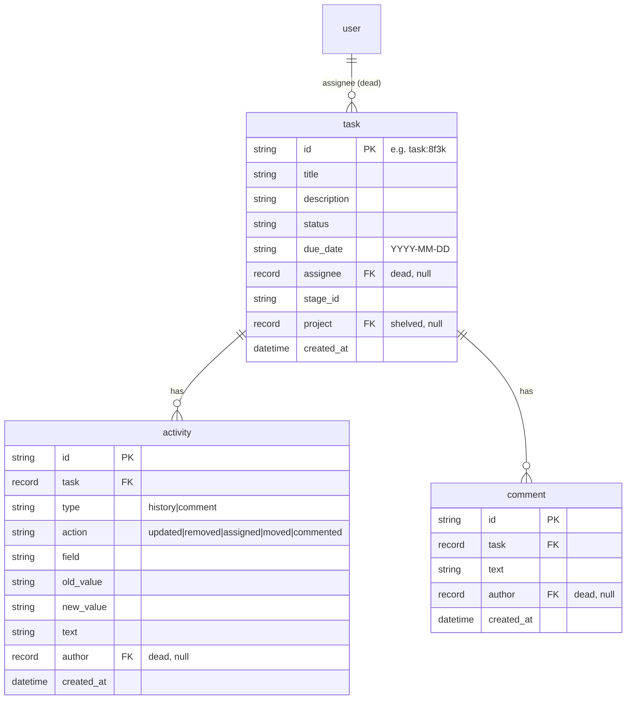

# task

A CLI + MCP server for managing **Tasks** — each with an auto-recorded **activity history** and free-text **comments** — backed by SurrealDB. Built for [Coolmogo.ai](https://coolmogo.ai).

> **Projects are shelved for now.** The projects table and all project code (dataclass, `TaskCLI` methods, CLI parser, MCP tools) remain in the repo as dead code to reintroduce later, but they are not wired into the active CLI/MCP surface. Tasks carry an optional `project_id`/`stage_id` but no project commands are exposed.

---

## 1. Project overview

The repo is split into one execution layer and three clients that wrap it:

- **`task_program/`** — execution layer. `TaskCLI` class + SurrealDB access. No CLI, MCP, or HTTP code.
- **`task_cli/`** — CLI client. Imports `TaskCLI` from `task_program`.
- **`task_mcp/`** — MCP server client. Imports `TaskCLI` from `task_program`.
- **`task_api/`** — FastAPI REST client. Imports `TaskCLI` from `task_program`.

`task_cli`, `task_mcp`, and `task_api` are peers; adding another consumer means a new sibling package, not changes to `task_program`.



**Data model** — `task` plus `activity` (auto-recorded history) and `comment`, with a `user` table referenced by `assignee`/`author` record links. `status` is free text (default `'To Do'`). Record ids are SurrealDB strings (e.g. `task:8f3k`), **not** auto-increment integers. Full schema for fresh installs in [`schema.surql`](./schema.surql); wipe all records (keeping the schema) with [`reset.surql`](./reset.surql). Import either by pasting into the Surrealist query editor (→ Run query) or via `surreal import`.

SurrealDB tables are singular (`task`, `activity`, `comment`, `user`) and ids are
string record ids. The execution layer normalizes the DB link fields (`assignee`,
`task`, `author`) into the `*_id` string keys shown in the API/CLI output.



**Credentials** — copy `.env.example` to `.env` and fill in `SURREALDB_URL`, `SURREALDB_USER` (root), and `SURREALDB_PASS`; `SURREALDB_NS`/`SURREALDB_DB` default to `main`. `task_program/db.py` walks up from cwd to find it, then falls back to `~/.config/taskcli/.env` (legacy folder name, kept for back-compat). See [`DB_SETUP.md`](./DB_SETUP.md) for connecting to SurrealDB (URL schemes, getting the values, importing the schema, troubleshooting).

**Setup** — see [`SETUP.md`](./SETUP.md) for step-by-step install instructions (one track for the CLI, one for the MCP server).

---

## 2. Execution layer (`task_program/`)

`task_program/program.py` defines:

- `TaskCLIError(Exception)` — raised on validation or not-found failures.
- `TaskCLI` — one method per verb:
  - Tasks: `add_task`, `list_tasks`, `get_task`, `update_task`, `delete_task`
  - Comments: `add_comment`, `list_comments`
  - Activities: `list_activities`
  - Projects (dead, kept for later): `add_project`, `list_projects`, `get_project`, `update_project`, `delete_project`

All methods return raw row dicts (or `list[dict]`). `due` accepts either `datetime.date` or an ISO string (`"2026-06-01"`); `status` is any string (default `'To Do'`).

`update_task` **auto-records history**: it diffs the current row against your update and writes one `activities` row per changed field (`action` = `updated`/`assigned`/`moved`, or `removed` when a field is cleared). `get_task` returns the task with embedded `activities` and `comments` lists. Validation is minimal now: task existence on lookups and "at least one field" on updates.

```python
from task_program import TaskCLI, TaskCLIError

api = TaskCLI()  # or TaskCLI(url=..., username=..., password=..., namespace="main", database="main")

t = api.add_task(title="Wireframes", description="first cut",
                 status="To Do", due="2026-06-15")
api.update_task(t["id"], status="In Progress")   # logs a 'moved' activity; t["id"] is e.g. "task:8f3k"
api.add_comment(t["id"], "kickoff call done")

full = api.get_task(t["id"])
print(full["status"], len(full["activities"]), len(full["comments"]))

try:
    api.get_task("task:doesnotexist")
except TaskCLIError as e:
    print(e)  # "Task #task:doesnotexist not found"
```

The SurrealDB client is `lru_cache`d in `task_program/db.py` — connected and signed in once per process. No ORM, no repository layer.

---

## 3. CLI tool (`task_cli/`)

The `task` command (or `python -m task_cli`) dispatches **entity → verb**: `task` → `add|list|show|update|delete`, plus `comment` → `add|list` and `activity` → `list`.

```bash
# tasks
task task add --title "Wireframes" --description "first cut" \
              --status "To Do" --due 2026-06-15 --stage-id backlog
task task list                                           # all
task task list --status "In Progress"                    # filter by status
task task show task:8f3k                                 # task + activity + comments
task task update task:8f3k --status "In Progress"        # logs a history entry
task task delete task:8f3k                               # cascades to activity/comments

# comments
task comment add --task task:8f3k --text "kickoff call done"
task comment list --task task:8f3k

# activity history (auto-recorded on task updates)
task activity list --task task:8f3k
```

Ids are SurrealDB record ids (e.g. `task:8f3k`) — copy them from the `task add` / `task list` output; they are no longer auto-increment integers.

**Required flags** — `task add`: `--title` only (everything else has a default). `comment add`: `--task --text`. `comment list` / `activity list`: `--task`. `--status` is free text (default `To Do`); `--assignee` takes a user record id but is non-functional until users are reintroduced.

**Errors** print as one clean line, no traceback (`task_cli/commands/*.py` catches `TaskCLIError` and calls `sys.exit(str(e))`):

| Input | Result |
|---|---|
| `task show task:nope` (nonexistent) | `Task #task:nope not found` |
| `comment add --task task:nope ...` | `Task #task:nope not found` |
| `update` with no fields | `Nothing to update. Provide at least one field.` |
| Missing creds | `SURREALDB_URL, SURREALDB_USER and SURREALDB_PASS must be set` |

---

## 4. MCP server (`task_mcp/`)

`task_mcp/server.py` registers one MCP tool per active `TaskCLI` method, with the same names as the methods (`add_task`, `list_tasks`, …). `TaskCLIError` is returned as `f"Error: {e}"` instead of raised — Claude sees a structured string, never a traceback.

Tools exposed: `add_task`, `list_tasks`, `get_task`, `update_task`, `delete_task`, `add_comment`, `list_comments`, `list_activities`. `due` is an ISO string (`"YYYY-MM-DD"`); `status` is free text (default `"To Do"`). The `*_project` tools exist in the file but their `@mcp.tool()` decorators are commented out, so they are not exposed.

Once configured in Claude Desktop, plain-English requests like *"list my in-progress tasks"* or *"add a comment to that task saying the design is approved"* are routed to the matching tool. Task ids are record-id strings (e.g. `task:8f3k`), which Claude carries between tool calls.

**Setup** — see [`SETUP.md`](./SETUP.md) Track B for Claude Desktop wiring (install with the `[mcp]` extra, `.env` placement, `claude_desktop_config.json` entry, troubleshooting).

---

## 5. REST API (`task_api/`)

`task_api/server.py` is a barebones [FastAPI](https://fastapi.tiangolo.com/) app — one route per active `TaskCLI` method. It's a peer of the CLI and MCP clients. `TaskCLIError` is translated to an HTTP error by a single exception handler: lookups that miss return **404**, validation failures return **400**, both with a `{"detail": "..."}` body. There is no auth. Locally it binds to `127.0.0.1` (loopback-only) for single-user use, matching the single-user, root-access design (the SurrealDB connection signs in as root, so no table permissions apply). When a `$PORT` env var is set — as hosting platforms like Render do — it instead binds `0.0.0.0:$PORT` so the platform's health check can reach it; `HOST` can override the host explicitly.

> **Deploying publicly?** The API has no authentication and talks to SurrealDB with root credentials, so a public `0.0.0.0` deploy exposes full read/write to anyone who can reach it. Put it behind an auth layer / network restriction, or keep it private, before exposing it to the internet.

**Install & run:**

```bash
pip install -e ".[api]"     # adds fastapi + uvicorn + OpenAI API deps
python -m task_api          # serves on http://127.0.0.1:8000
```

Interactive Swagger docs are at `http://127.0.0.1:8000/docs`.

**Endpoints:**

| Method & path                        | Action                                              |
|--------------------------------------|-----------------------------------------------------|
| `POST   /tasks`                      | Create a task (JSON body)                           |
| `GET    /tasks?status=&project=`     | List tasks, optional `status`/`project` filters     |
| `GET    /tasks/{id}`                 | Fetch one task with embedded `activities`+`comments`|
| `PATCH  /tasks/{id}`                 | Update sent fields only (auto-logs history)         |
| `DELETE /tasks/{id}`                 | Delete a task (history + comments cascade)          |
| `POST   /tasks/{task_id}/comments`   | Add a comment and optionally trigger Spark          |
| `GET    /tasks/{task_id}/comments`   | List a task's comments, oldest first                |
| `GET    /tasks/{task_id}/activities` | List a task's activity history, oldest first        |

Write endpoints take a JSON body. `POST /tasks/{task_id}/comments` now expects `{"content": "..."}` and triggers Spark only when the task is currently assigned to Spark. Assigning a task to `user:spark` also triggers Spark's first turn. `due` is an ISO string (`"YYYY-MM-DD"`); `status` is free text (default `"To Do"`). On `PATCH`, only the fields present in the body change — omitted fields are left untouched.

**Examples — curl (run in a terminal):**

```bash
# create
curl -X POST http://127.0.0.1:8000/tasks \
  -H "Content-Type: application/json" \
  -d '{"title": "Write report", "status": "In Progress", "due": "2026-06-01"}'

# update one field (records a history entry); the id is the record id from the create response
curl -X PATCH http://127.0.0.1:8000/tasks/task:8f3k \
  -H "Content-Type: application/json" \
  -d '{"status": "Done"}'

# fetch with embedded activities + comments
curl http://127.0.0.1:8000/tasks/task:8f3k

# add a comment
curl -X POST http://127.0.0.1:8000/tasks/task:8f3k/comments \
  -H "Content-Type: application/json" \
  -d '{"content": "design approved"}'
```

> **Record-id paths.** Task ids are SurrealDB strings like `task:8f3k`, returned by `POST /tasks`. They contain a colon; in a URL path that's fine as-is, but if your HTTP client encodes it, `%3A` also works (`/tasks/task%3A8f3k`).

**Using Postman (or any GUI client):** the `curl` lines above are *shell commands* — don't paste a whole `curl …` line into the URL bar, or the `-H`/`-d`/`\` get treated as part of the path and you'll get `404 {"detail": "Not Found"}`. Instead set the request up by hand:

1. **Method** — e.g. `POST`.
2. **URL** — just the endpoint, e.g. `http://127.0.0.1:8000/tasks` (for `PATCH`/`GET` on one task, append the record id: `http://127.0.0.1:8000/tasks/task:8f3k`).
3. **Body** — select **raw**, then **JSON** in the type dropdown (this sets `Content-Type: application/json` for you), and paste only the JSON object:
   ```json
   {"title": "Write report", "status": "In Progress", "due": "2026-06-01"}
   ```
4. **Send** — a successful create returns `201` with the new task (including its `id`).

Shortcut: Postman's **Import** button accepts a pasted `curl …` command and fills in the method, URL, headers, and body automatically.

### Spark MVP note

1. Set either `OPENAI_API_KEY` or `GOOGLE_API_KEY` in the backend environment or `.env`, and choose `SPARK_LLM_PROVIDER=openai` or `SPARK_LLM_PROVIDER=google`.
2. Install the API extras with `pip install -e ".[api]"`.
3. Start the API with `python -m task_api`.
4. Assign the task to Spark with `{"assignee_id": "user:spark"}` on `PATCH /tasks/{task_id}`.
5. POST to `/tasks/{task_id}/comments` with:

```json
{"content": "Summarize this task"}
```

6. Confirm the user comment is saved.
7. Confirm Spark's reply is saved as a second task comment when generation succeeds.
