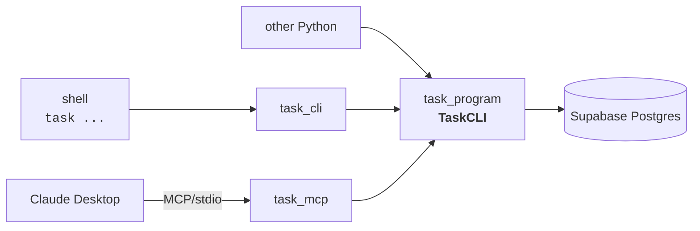
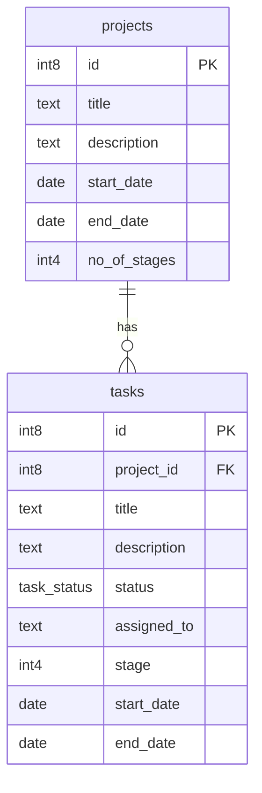

# task

A CLI + MCP server for managing **Projects** and the **Tasks** that belong to them, backed by Supabase Postgres. Built for [Coolmogo.ai](https://coolmogo.ai). 

---

## 1. Project overview

The repo is split into one execution layer and two clients that wrap it:

- **`task_program/`** — execution layer. `TaskCLI` class + Supabase access. No CLI or MCP code.
- **`task_cli/`** — CLI client. Imports `TaskCLI` from `task_program`.
- **`task_mcp/`** — MCP server client. Imports `TaskCLI` from `task_program`.

`task_cli` and `task_mcp` are peers; adding another consumer (web service, scripts) means a new sibling package, not changes to `task_program`.



**Data model** — two tables (`projects`, `tasks`) and one `task_status` enum (`todo` / `in_progress` / `done`). Full DDL in [`schema.sql`](./schema.sql) — idempotent, paste into the Supabase SQL editor.



**Credentials** — copy `.env.example` to `.env` and fill in `SUPABASE_URL` and `SUPABASE_KEY`. `task_program/db.py` walks up from cwd to find it, then falls back to `~/.config/taskcli/.env` (legacy folder name, kept for back-compat).

**Setup** — see [`SETUP.md`](./SETUP.md) for step-by-step install instructions (one track for the CLI, one for the MCP server).

---

## 2. Execution layer (`task_program/`)

`task_program/api.py` defines:

- `TaskCLIError(Exception)` — raised on validation or not-found failures.
- `TaskCLI` — one method per CRUD verb:
  - Projects: `add_project`, `list_projects`, `get_project`, `update_project`, `delete_project`
  - Tasks: `add_task`, `list_tasks`, `get_task`, `update_task`, `delete_task`

All methods return raw row dicts (or `list[dict]`). Date arguments accept either `datetime.date` or ISO strings (`"2026-06-01"`). `status` is a plain string matching the enum.

Validation centralized in `TaskCLI`: `end_date >= start_date`, `stages >= 1`, `1 <= stage <= project.no_of_stages`, project/task existence on lookups, and "at least one field" on updates. The stage upper bound is enforced in code rather than SQL because Postgres `CHECK` can't reference another table without a trigger.

```python
from task_program import TaskCLI, TaskCLIError

api = TaskCLI()  # or TaskCLI(supabase_url=..., supabase_key=...)

p = api.add_project(title="Launch v1", description="Q3", start="2026-06-01",
                    end="2026-09-30", stages=4)
t = api.add_task(project=p["id"], title="Wireframes", description="",
                 status="todo", assigned_to="Aarav", stage=1,
                 start="2026-06-01", end="2026-06-15")
api.update_task(t["id"], status="in_progress")

try:
    api.get_project(999)
except TaskCLIError as e:
    print(e)  # "Project #999 not found"
```

Supabase client is `lru_cache`d in `task_program/db.py` — built once per process. No ORM, no repository layer.

---

## 3. CLI tool (`task_cli/`)

The `task` command (or `python -m task_cli`) dispatches **entity → verb**: `project|task` → `add|list|show|update|delete`.

```bash
# projects
task project add --title "Launch v1" --description "Q3" \
                 --start 2026-06-01 --end 2026-09-30 --stages 4
task project list
task project show 1
task project update 1 --description "Pushed to Q4" --end 2026-12-15
task project delete 1                                    # cascades to tasks

# tasks
task task add --project 1 --title "Wireframes" --description "" \
              --status todo --assigned-to "Aarav" --stage 1 \
              --start 2026-06-01 --end 2026-06-15
task task list                                           # all
task task list --project 1 --status in_progress          # filter
task task show 1
task task update 1 --status in_progress --assigned-to "Sam"
task task delete 1
```

**Required flags** — `project add`: `--title --start --end --stages`. `task add`: `--project --title --stage --start --end`. Everything else has a default.

**Errors** print as one clean line, no traceback (`task_cli/commands/*.py` catches `TaskCLIError` and calls `sys.exit(str(e))`):

| Input | Result |
|---|---|
| `--end` before `--start` | `end date must be on or after start date` |
| `--stage 99` on a 4-stage project | `Stage must be 1..4 for project #N` |
| `--project 999` (nonexistent) | `Project #999 not found` |
| `update` with no fields | `Nothing to update. Provide at least one field.` |
| Missing creds | `SUPABASE_URL and SUPABASE_KEY must be set` |

---

## 4. MCP server (`task_mcp/`)

`task_mcp/server.py` registers one MCP tool per `TaskCLI` method, with the same names as the methods (`add_project`, `list_tasks`, …). `TaskCLIError` is returned as `f"Error: {e}"` instead of raised — Claude sees a structured string, never a traceback.

Tools exposed: `add_project`, `list_projects`, `get_project`, `update_project`, `delete_project`, `add_task`, `list_tasks`, `get_task`, `update_task`, `delete_task`. Dates are ISO strings (`"YYYY-MM-DD"`); `status` is `"todo"`, `"in_progress"`, or `"done"`.

Once configured in Claude Desktop, plain-English requests like *"list my projects"* or *"create a task in project 3 called Wireframes"* are routed to the matching tool.

**Setup** — see [`SETUP.md`](./SETUP.md) Track B for Claude Desktop wiring (install with the `[mcp]` extra, `.env` placement, `claude_desktop_config.json` entry, troubleshooting).
