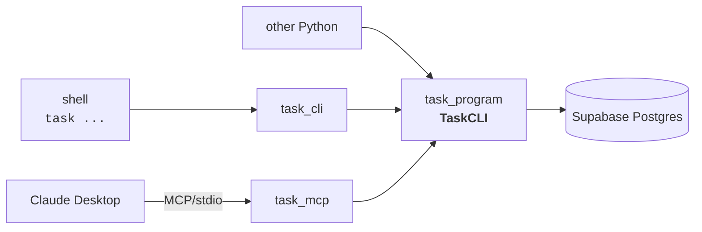
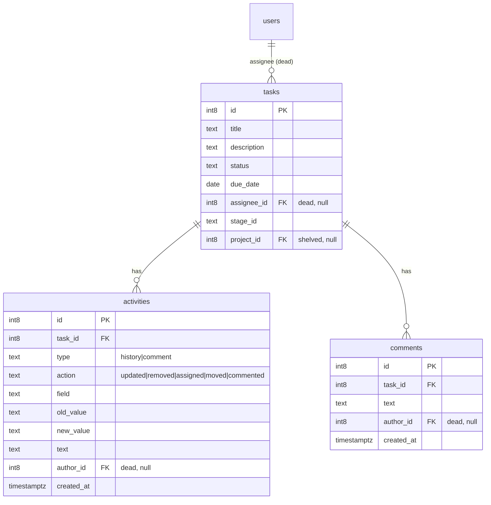

# task

A CLI + MCP server for managing **Tasks** — each with an auto-recorded **activity history** and free-text **comments** — backed by Supabase Postgres. Built for [Coolmogo.ai](https://coolmogo.ai).

> **Projects are shelved for now.** The projects table and all project code (dataclass, `TaskCLI` methods, CLI parser, MCP tools) remain in the repo as dead code to reintroduce later, but they are not wired into the active CLI/MCP surface. Tasks carry an optional `project_id`/`stage_id` but no project commands are exposed.

---

## 1. Project overview

The repo is split into one execution layer and two clients that wrap it:

- **`task_program/`** — execution layer. `TaskCLI` class + Supabase access. No CLI or MCP code.
- **`task_cli/`** — CLI client. Imports `TaskCLI` from `task_program`.
- **`task_mcp/`** — MCP server client. Imports `TaskCLI` from `task_program`.

`task_cli` and `task_mcp` are peers; adding another consumer (web service, scripts) means a new sibling package, not changes to `task_program`.



**Data model** — `tasks` plus `activities` (auto-recorded history) and `comments`, with a `users` table referenced by `assignee_id`/`author_id` as *dead structure* (no rows yet — user management isn't built, so assignee/authors stay null). `status` is free text (default `'To Do'`). Full DDL for fresh installs in [`schema.sql`](./schema.sql); to reshape an existing database use [`migration.sql`](./migration.sql) (destructive — see its header). Both paste into the Supabase SQL editor.



**Credentials** — copy `.env.example` to `.env` and fill in `SUPABASE_URL` and `SUPABASE_KEY`. `task_program/db.py` walks up from cwd to find it, then falls back to `~/.config/taskcli/.env` (legacy folder name, kept for back-compat).

**Setup** — see [`SETUP.md`](./SETUP.md) for step-by-step install instructions (one track for the CLI, one for the MCP server).

---

## 2. Execution layer (`task_program/`)

`task_program/program.py` defines:

- `TaskCLIError(Exception)` — raised on validation or not-found failures.
- `TaskCLI` — one method per verb:
  - Tasks: `add_task`, `list_tasks`, `get_task`, `update_task`, `delete_task`
  - Comments: `add_comment`, `list_comments`
  - Activities: `list_activities`
  - Projects (dead, kept for later): `add_project`, `list_projects`, `get_project`, `update_project`, `delete_project`

All methods return raw row dicts (or `list[dict]`). `due` accepts either `datetime.date` or an ISO string (`"2026-06-01"`); `status` is any string (default `'To Do'`).

`update_task` **auto-records history**: it diffs the current row against your update and writes one `activities` row per changed field (`action` = `updated`/`assigned`/`moved`, or `removed` when a field is cleared). `get_task` returns the task with embedded `activities` and `comments` lists. Validation is minimal now: task existence on lookups and "at least one field" on updates.

```python
from task_program import TaskCLI, TaskCLIError

api = TaskCLI()  # or TaskCLI(supabase_url=..., supabase_key=...)

t = api.add_task(title="Wireframes", description="first cut",
                 status="To Do", due="2026-06-15")
api.update_task(t["id"], status="In Progress")   # logs a 'moved' activity
api.add_comment(t["id"], "kickoff call done")

full = api.get_task(t["id"])
print(full["status"], len(full["activities"]), len(full["comments"]))

try:
    api.get_task(999)
except TaskCLIError as e:
    print(e)  # "Task #999 not found"
```

Supabase client is `lru_cache`d in `task_program/db.py` — built once per process. No ORM, no repository layer.

---

## 3. CLI tool (`task_cli/`)

The `task` command (or `python -m task_cli`) dispatches **entity → verb**: `task` → `add|list|show|update|delete`, plus `comment` → `add|list` and `activity` → `list`.

```bash
# tasks
task task add --title "Wireframes" --description "first cut" \
              --status "To Do" --due 2026-06-15 --stage-id backlog
task task list                                           # all
task task list --status "In Progress"                    # filter by status
task task show 1                                          # task + activity + comments
task task update 1 --status "In Progress"                # logs a history entry
task task delete 1                                        # cascades to activity/comments

# comments
task comment add --task 1 --text "kickoff call done"
task comment list --task 1

# activity history (auto-recorded on task updates)
task activity list --task 1
```

**Required flags** — `task add`: `--title` only (everything else has a default). `comment add`: `--task --text`. `comment list` / `activity list`: `--task`. `--status` is free text (default `To Do`); `--assignee` takes a user id but is non-functional until users are reintroduced.

**Errors** print as one clean line, no traceback (`task_cli/commands/*.py` catches `TaskCLIError` and calls `sys.exit(str(e))`):

| Input | Result |
|---|---|
| `task show 999` (nonexistent) | `Task #999 not found` |
| `comment add --task 999 ...` | `Task #999 not found` |
| `update` with no fields | `Nothing to update. Provide at least one field.` |
| Missing creds | `SUPABASE_URL and SUPABASE_KEY must be set` |

---

## 4. MCP server (`task_mcp/`)

`task_mcp/server.py` registers one MCP tool per active `TaskCLI` method, with the same names as the methods (`add_task`, `list_tasks`, …). `TaskCLIError` is returned as `f"Error: {e}"` instead of raised — Claude sees a structured string, never a traceback.

Tools exposed: `add_task`, `list_tasks`, `get_task`, `update_task`, `delete_task`, `add_comment`, `list_comments`, `list_activities`. `due` is an ISO string (`"YYYY-MM-DD"`); `status` is free text (default `"To Do"`). The `*_project` tools exist in the file but their `@mcp.tool()` decorators are commented out, so they are not exposed.

Once configured in Claude Desktop, plain-English requests like *"list my in-progress tasks"* or *"add a comment to task 3 saying the design is approved"* are routed to the matching tool.

**Setup** — see [`SETUP.md`](./SETUP.md) Track B for Claude Desktop wiring (install with the `[mcp]` extra, `.env` placement, `claude_desktop_config.json` entry, troubleshooting).
